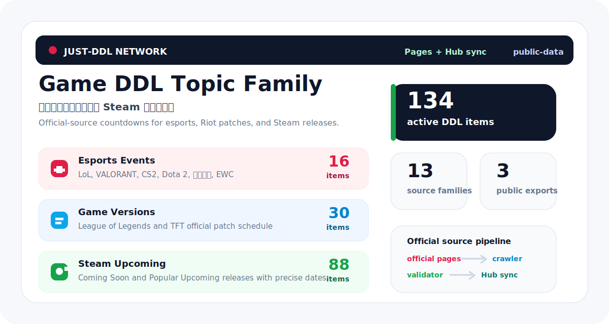
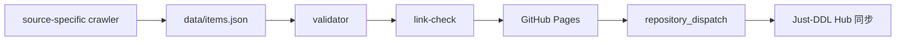

<p align="center">
  
</p>

<h1 align="center">电竞赛事、游戏版本与 Steam 新游 DDL</h1>

<p align="center">
  英雄联盟、王者荣耀、VALORANT、CS2、Dota 2、电竞世界杯和 Steam 预发布新游追踪。<br>
  现在也作为 Just-DDL 的游戏专题族仓库，额外输出游戏版本更新与 Steam 新游倒计时。
</p>

<p align="center">
  <a href="https://just-agent.github.io/game-ddl/"></a>
  <a href="https://just-agent.github.io/just-ddl/#/topic/game-ddl"></a>
  <a href="https://github.com/Just-Agent/game-ddl/actions/workflows/update-data.yml"></a>
  
</p>

<p align="center">
  <a href="https://just-agent.github.io/game-ddl/"><strong>打开专题站</strong></a>
  ·
  <a href="https://just-agent.github.io/just-ddl/#/topic/game-ddl">在 Just-DDL Hub 查看</a>
  ·
  <a href="public-data/items.json">下载数据 JSON</a>
  ·
  <a href="public-data/sources.json">查看来源清单</a>
</p>

## 为什么拆成独立仓库

电竞赛事 DDL 是 Just-DDL Network 的一个独立专题仓库。它单独维护数据、crawler、validator、link-check、GitHub Pages 和 Hub 同步，这样每个专题可以按自己的来源节奏更新，不会互相拖累。

> 数据仅供参考；报名、参赛、购票和投稿等关键决策请以官方页面为准。

## 专题总览

| 指标 | 当前值 |
| --- | ---: |
| 电竞赛事条目 | 16 |
| 游戏版本条目 | 30 |
| Steam 新游条目 | 88 |
| 子专题 | 9 |
| 来源族 | 13 |
| Pages | [https://just-agent.github.io/game-ddl/](https://just-agent.github.io/game-ddl/) |
| Hub | [https://just-agent.github.io/just-ddl/#/topic/game-ddl](https://just-agent.github.io/just-ddl/#/topic/game-ddl) |

## 专题族数据出口

`game-ddl` 保持原仓库名和 Pages 地址不变，但同时为 Hub 输出三个 Topic：

| Hub Topic | 数据出口 | 来源策略 |
| --- | --- | --- |
| `game-ddl` 电竞赛事 | [`public-data/items.json`](public-data/items.json) | 赛事官网、主办方公告和权威赛事页 |
| `game-version-ddl` 游戏版本 | [`public-data/game-version-ddl/items.json`](public-data/game-version-ddl/items.json) | Riot 官方 LoL/TFT patch schedule，后续可扩展到更多官方版本公告 |
| `steamgame-ddl` Steam 新游 | [`public-data/steamgame-ddl/items.json`](public-data/steamgame-ddl/items.json) | Steam 官方 Coming Soon 与 Popular Upcoming；精确日期才进入倒计时，模糊日期显示待官方公告 |

Hub 注册 `game-version-ddl` 和 `steamgame-ddl` 时会把它们当作独立 Topic 展示。这样一个仓库可以维护相近专题，但用户在主题广场里仍能单独收藏“电竞赛事”“游戏版本”或“Steam 新游”。

`data/` 是维护数据，允许保留 crawler、预测依据和校验字段；`public-data/` 是 Pages、Hub 和小程序消费的公开出口，构建时会剥离内部维护字段。

公开说明：Riot Support 页面在部分自动化环境可能触发访问保护；当前版本按官方 patch schedule 核验后写入 JSON，并保留 crawler 检查链路，页面展示仍以官方来源链接为准。

`game-version-ddl` 已加入 LoL 2026 官方 patch schedule：已经发布的 patch 进入历史节点，未来 patch 进入官方倒计时；2027 年首个 patch 仅显示为预测窗口，不作为 Riot 官方日期。

`steamgame-ddl` 使用 Steam 官方预发布搜索页作为来源：`Coming Soon` 提供日期优先轨，`Popular Upcoming` 提供热门预发布轨。只有 Steam 显示精确到日的发行日期才生成倒计时；`Coming soon`、仅月份、仅年份、季度或 TBA 文案只显示“待官方公告”。

## 子专题矩阵

不同项目使用不同颜色和缩略标识，专题站卡片里也会按同一套视觉规范展示。

| 子专题 | 条目 | 视觉/内容边界 | 下一条代表节点 |
| --- | ---: | --- | --- |
|  | 3 | IEM / Major / EWC | [IEM Cologne Major 2026](https://pro.eslgaming.com/tour/csgo/cologne) |
|  | 1 | VCT Masters 与国际赛 | [VALORANT Masters London 2026](https://www.thespike.gg/events/valorant-champions-tour-2026-masters-london-2026/4148) |
|  | 4 | ENC / EWC 王者荣耀项目 | [Honor of Kings ENC Ranking Cutoff](https://esportsnationscup.com/en/press-releases/enc-adds-honor-of-kings-to-the-games-lineup) |
|  | 2 | The International 与预选赛 | [The International 2026 Open Qualifiers](https://cdn.cloudflare.steamstatic.com/apps/dota2/assets/RFP_TI_2026.pdf) |
|  | 5 | MSI / Worlds / LCS / EWC | [LCS Spring Finals 2026](https://lolesports.com/en-US/news/lcs-spring-finals-heads-to-asu-at-mullett-arena) |
|  | 1 | 电竞世界杯综合窗口 | [Esports World Cup 2026](https://esportsworldcup.com/en/news/ewc26-confirms-the-return-of-20-games) |
|  | 30 | LoL / TFT patch schedule、历史版本和预测窗口 | [League of Legends Patch 26.11](https://support-leagueoflegends.riotgames.com/hc/en-us/articles/360018987893-Patch-Schedule-League-of-Legends) |
|  | 88 | Steam Coming Soon / Popular Upcoming 预发布游戏 | [Steam Coming Soon](https://store.steampowered.com/search/?filter=comingsoon) |

## 近期节点

| 类型 | 事件 | 日期窗口 | 阶段 | 来源 |
| --- | --- | --- | --- | --- |
|  | [IEM Cologne Major 2026](https://pro.eslgaming.com/tour/csgo/cologne) | Jun 2-21, 2026 | 开赛 | ESL Pro Tour |
|  | [VALORANT Masters London 2026](https://www.thespike.gg/events/valorant-champions-tour-2026-masters-london-2026/4148) | Jun 6-21, 2026 | 开赛 | THESPIKE.GG Event Listing |
|  | [Honor of Kings ENC Ranking Cutoff](https://esportsnationscup.com/en/press-releases/enc-adds-honor-of-kings-to-the-games-lineup) | Jun 7, 2026 | 资格/排名 | Esports Nations Cup |
|  | [The International 2026 Open Qualifiers](https://cdn.cloudflare.steamstatic.com/apps/dota2/assets/RFP_TI_2026.pdf) | Jun 9-12, 2026 | 资格/排名 | Valve / Dota 2 |
|  | [LCS Spring Finals 2026](https://lolesports.com/en-US/news/lcs-spring-finals-heads-to-asu-at-mullett-arena) | Jun 13-14, 2026 | 决赛 | LoL Esports |
|  | [Mid-Season Invitational 2026](https://lolesports.com/en-US/news/msi-and-worlds-updates) | Jun 28 - Jul 12, 2026 | 开赛 | LoL Esports |
|  | [Honor of Kings ENC Regional Qualifiers](https://esportsnationscup.com/en/press-releases/enc-adds-honor-of-kings-to-the-games-lineup) | Jul 3-5, 2026 | 资格/排名 | Esports Nations Cup |
|  | [Esports World Cup 2026](https://esportsworldcup.com/en/news/ewc26-confirms-the-return-of-20-games) | Jul 6 - Aug 23, 2026 | 项目窗口 | Esports World Cup |

## 数据来源

来源策略：官方/主办方优先；当官方详情页尚未开放时，允许使用权威聚合页作为临时入口，并在后续 crawler 中替换为官方详情 URL。

| 来源 | 类型 | 入口 | 关联条目 |
| --- | --- | --- | ---: |
| BLAST / PGL Event Listing | 赛事页 | [blast.tv](https://blast.tv/cs/tournaments/pgl-singapore-major-2026) | 1 |
| ESL Pro Tour | 赛事官网 | [pro.eslgaming.com](https://pro.eslgaming.com/tour/csgo/cologne) | 1 |
| Esports Nations Cup | 主办方公告 | [esportsnationscup.com](https://esportsnationscup.com/en/press-releases/enc-adds-honor-of-kings-to-the-games-lineup) | 3 |
| Esports World Cup | 主办方公告 | [esportsworldcup.com](https://esportsworldcup.com/en/news/ewc26-confirms-the-return-of-20-games) | 3 |
| Esports World Cup | 主办方公告 | [esportsworldcup.com](https://www.esportsworldcup.com/en/news/cs2-locked-in-for-ewc-2026-2027) | 1 |
| LoL Esports | 官方赛事公告 | [lolesports.com](https://lolesports.com/en-US/news/lcs-spring-finals-heads-to-asu-at-mullett-arena) | 1 |
| LoL Esports | 官方赛事公告 | [lolesports.com](https://lolesports.com/en-US/news/msi-and-worlds-updates) | 3 |
| THESPIKE.GG Event Listing | 权威赛事页 | [thespike.gg](https://www.thespike.gg/events/valorant-champions-tour-2026-masters-london-2026/4148) | 1 |
| Valve / Dota 2 | 官方文件 | [cdn.cloudflare.steamstatic.com](https://cdn.cloudflare.steamstatic.com/apps/dota2/assets/RFP_TI_2026.pdf) | 2 |
| League of Legends Support | 官方版本表 | [support-leagueoflegends.riotgames.com](https://support-leagueoflegends.riotgames.com/hc/en-us/articles/360018987893-Patch-Schedule-League-of-Legends) | 25 |
| Teamfight Tactics Support | 官方版本表 | [support-teamfighttactics.riotgames.com](https://support-teamfighttactics.riotgames.com/hc/en-us/articles/37127675562387-Patch-Schedule-Teamfight-Tactics) | 5 |
| Steam Coming Soon | 官方商店搜索页 | [store.steampowered.com](https://store.steampowered.com/search/?filter=comingsoon) | 50 |
| Steam Popular Upcoming | 官方商店搜索页 | [store.steampowered.com](https://store.steampowered.com/search/?filter=popularcomingsoon) | 38 |

## 自动化链路



## 本地检查

```bash
npm run crawl
npm run build
npm run link-check
```

`link-check` 默认是 warning-only。等官方详情 URL 更稳定后，可以设置 `STRICT_LINK_CHECK=1` 切到严格模式。

## 目录结构

```text
.
├─ data/
│  ├─ items.json
│  ├─ sources.json
│  ├─ crawl-report.json
│  ├─ game-version-ddl/
│     ├─ items.json
│     └─ sources.json
│  └─ steamgame-ddl/
│     ├─ items.json
│     └─ sources.json
├─ public-data/
│  ├─ items.json
│  ├─ sources.json
│  ├─ game-version-ddl/
│     ├─ items.json
│     └─ sources.json
│  └─ steamgame-ddl/
│     ├─ items.json
│     └─ sources.json
├─ scripts/
│  ├─ crawl-sources.mjs
│  ├─ validate-data.mjs
│  └─ link-check.mjs
├─ .github/workflows/
│  ├─ deploy-pages.yml
│  └─ update-data.yml
└─ index.html
```

## 贡献数据

新增条目请优先提供：

- 官方/主办方页面 URL
- 明确的 deadline 或 event start 时间
- 子专题归属
- 来源说明

微信小程序版本即将上线，敬请期待。
